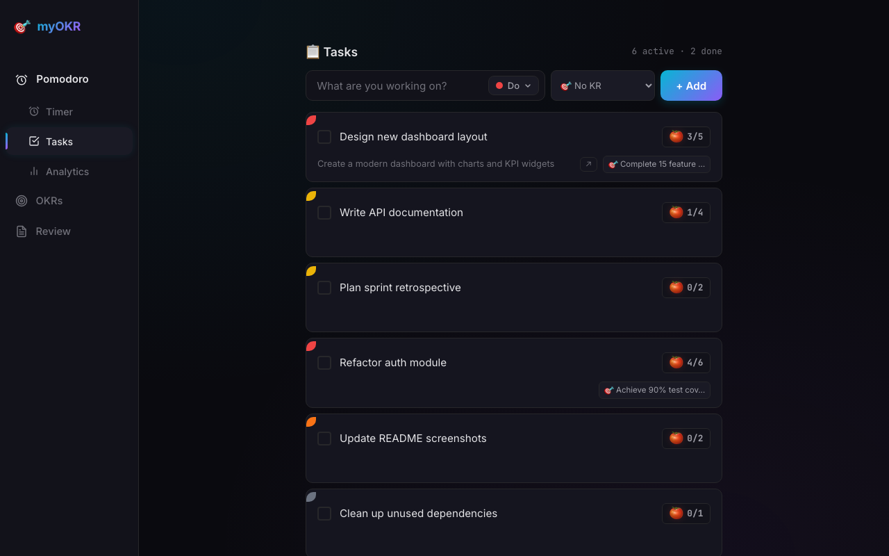
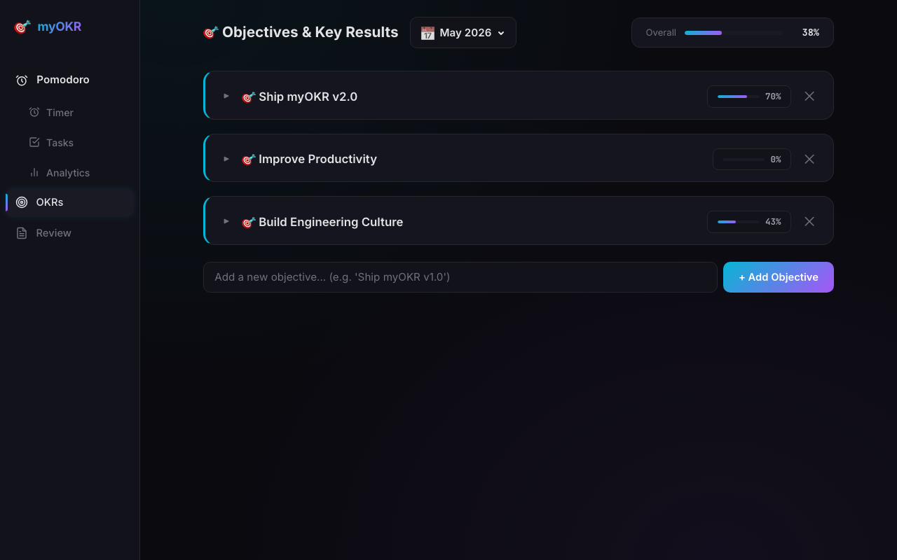
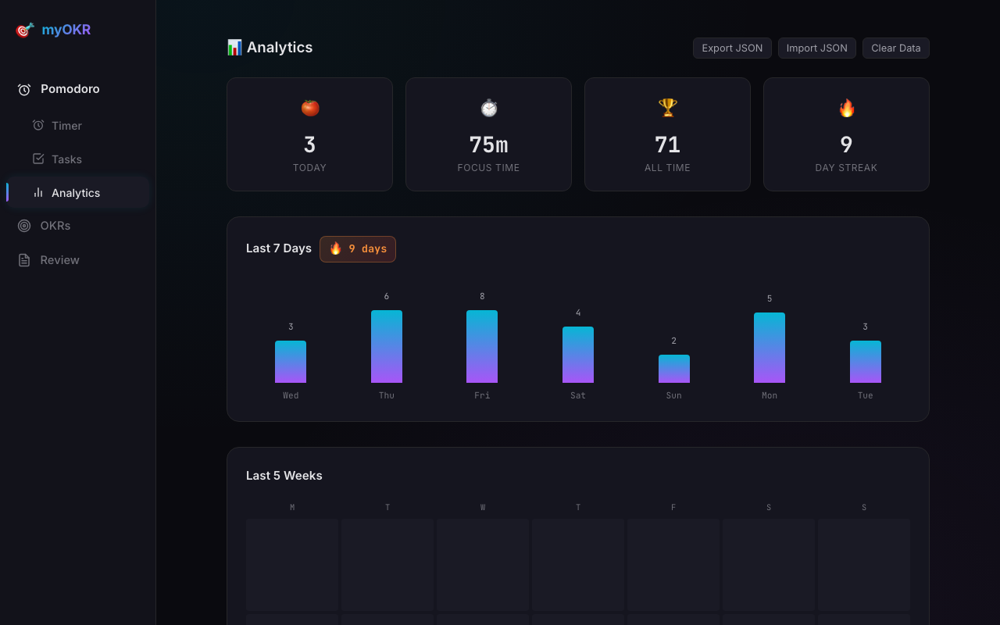

<a id="readme-top"></a>

[![Sponsors][sponsors-shield]][sponsors-url]

<!-- PROJECT LOGO -->
<br />
<div align="center">
  <h3 align="center">myOKR</h3>

  <p align="center">
    A cross-platform desktop application for productivity and goal management.
    <br />
    <br />
    <a href="#-quick-start"><strong>🚀 Quick Start »</strong></a>
    <br />
    <br />
    <a href="#-key-features">✨ Features</a>
    ·
    <a href="#-support-the-project">💖 Sponsor</a>
  </p>
</div>

## A complete, local, desktop-first alternative to scattered goal trackers

myOKR transforms your workflow by combining the immediate action of a Pomodoro timer with the long-term vision of an OKR (Objectives and Key Results) system. Track your daily tasks and watch them automatically feed into your broader monthly goals.

<div align="center">
  
  
</div>
<div align="center">
  
</div>

### Built With

[![Tauri][Tauri-badge]][Tauri-url] [![React][React-badge]][React-url] [![TypeScript][TypeScript-badge]][TypeScript-url] [![Vite][Vite-badge]][Vite-url]

---

## 🚀 Quick Start

### Prerequisites
- [Node.js](https://nodejs.org)
- [Rust](https://www.rust-lang.org/tools/install)
- OS-specific dependencies for Tauri (e.g., Xcode Command Line Tools for macOS)

### Step 1: Clone the repository
```bash
git clone https://github.com/trongdth/myOKR.git
cd myOKR
```

### Step 2: Install dependencies
```bash
npm install
```

### Step 3: Run locally
```bash
npm run tauri dev
```

### Step 4: Build for Production
```bash
npm run tauri build
```

---

## ✨ Key Features

### Goal Management (OKRs)
- **🎯 OKR Tree**: Create monthly cycles, define Objectives, and break them down into measurable Key Results.
- **📊 Progress Tracking**: Update progress directly and set confidence levels (🟢 On Track, 🟡 At Risk, 🔴 Off Track).
- **📋 Weekly Review**: Guided check-in flow with confidence scoring and auto-populated insights from your Pomodoro data.

### Productivity Tools
- **🍅 Pomodoro Timer**: Classic focus/break cycles with system tray integration.
- **✅ Task Management**: Built-in Eisenhower matrix prioritization and inline editing.
- **🔗 Task-to-KR Linking**: Optionally link Pomodoro tasks to your OKR Key Results to ensure daily actions align with larger goals.

### Desktop Experience
- **🌙 Dark Tech Aesthetic**: Beautiful, responsive, and distraction-free user interface.
- **🔔 Native Notifications**: Desktop notifications for session completions.
- **🔒 Persistent Storage**: Data is saved locally across sessions using `@tauri-apps/plugin-store`.
- **⬇️ Minimize to Tray**: Keeps running in the background when the main window is closed.

---

## 💖 Support the Project

If you find this project helpful, consider supporting its development! Your sponsorship helps me dedicate more time to maintaining and improving myOKR.

[](https://github.com/sponsors/trongdth)

<!-- MARKDOWN LINKS & IMAGES -->
[sponsors-shield]: https://img.shields.io/github/sponsors/trongdth?style=for-the-badge&color=ff69b4
[sponsors-url]: https://github.com/sponsors/trongdth
[Tauri-badge]: https://img.shields.io/badge/tauri-%2324C8DB.svg?style=for-the-badge&logo=tauri&logoColor=%23FFFFFF
[Tauri-url]: https://tauri.app/
[React-badge]: https://img.shields.io/badge/react-%2320232a.svg?style=for-the-badge&logo=react&logoColor=%2361DAFB
[React-url]: https://reactjs.org/
[TypeScript-badge]: https://img.shields.io/badge/typescript-%23007ACC.svg?style=for-the-badge&logo=typescript&logoColor=white
[TypeScript-url]: https://www.typescriptlang.org/
[Vite-badge]: https://img.shields.io/badge/vite-%23646CFF.svg?style=for-the-badge&logo=vite&logoColor=white
[Vite-url]: https://vitejs.dev/
